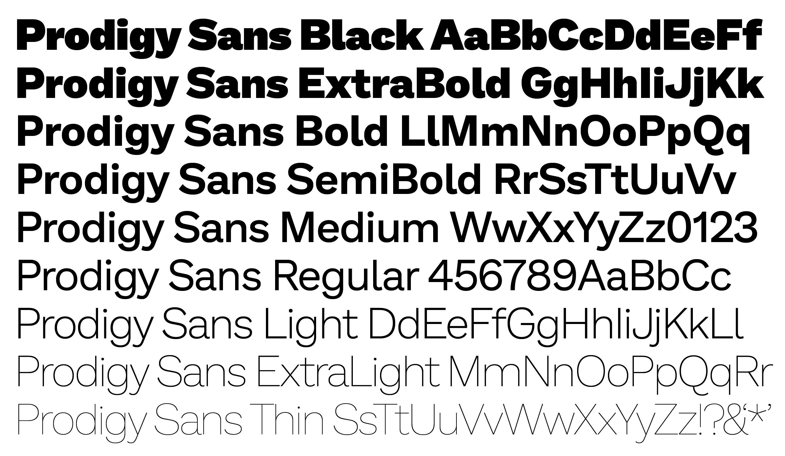

# Prodigy Sans

Prodigy Sans is a typeface family based on [Work Sans](https://github.com/weiweihuanghuang/Work-Sans) commissioned by [DesignStudio](https://design.studio/) for [Prodigy Education Inc](https://www.prodigygame.com/):

- A new master has been added for Bold with lower contrast and rounder shapes
- Cap height has been scaled up to match ascender height
- Stroke terminals are different
- a, g has a new design
- Regular and Thin has tighter tracking
- Drawing is cleaner

## License
Prodigy Sans is licensed under the SIL Open Font License v1.1 (<http://scripts.sil.org/OFL>)

To view the copyright and specific terms and conditions please refer to [OFL.txt](OFL.txt).